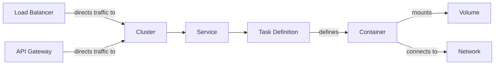

# Módulo Terraform para AWS ECS

Esse modulo terraform é utilizado para criar Service, Task Definition e Target Group no loadbalance do cluster.

- [Documentação Modulo Terrafor](module-docs.md)



### Backend

Terraform utiliza o arquivo de backend para armazenar o estado atual da infraestrutura. 

```terraform
terraform {
  backend "s3" {
    bucket         = "drcash-terraform-tfstate"
    key            = "aws/<SERVICE-NAME>/terraform.tfstate"
    region         = "us-east-1"
    dynamodb_table = "terraform_state_lock"
  }
}
```

### Provider

Provider será declarado que tipo de Cloud ou Serviço SAAS a infraestrutura será provisionada. 

```terraform
provider "aws" {
  region = "us-east-1"
}
```

### Version

Version declaramos a versão dos providers. 

```terraform
terraform {
  required_providers {
    aws = {
      source  = "hashicorp/aws"
      version = "~> 5.0"
    }
  }
  required_version = "~> 1.7.4"
}
```

### Module

Modulo é a principal forma de empacotar e reutilizar configurações de recursos com o Terraform.

```terraform
module "ecs_service" {
  source = "git::ssh://git@github.com/drcash-brazil/drcash_platform_infrastructure.git//modules/aws/ecs-app?ref=<VERSION>"
  name             = "meu-servico"
  cluster_name     = "meu-cluster"
  desired_count    = 2
  assign_public_ip = false
  security_groups  = ["sg-0123456789abcdef0"]
  subnets          = ["subnet-0123456789abcdef0"]
  container_definitions = [
    {
      name         = "meu-container"
      image        = "minha-imagem:tag"
      cpu          = 256
      memory       = 512
      essential    = true
      port_mappings = [
        {
          containerPort = 8080
          hostPort      = 8080
          protocol      = "tcp"
        }
      ]
      environment_variables = [
        {
          name  = "VAR1"
          value = "valor1"
        },
        {
          name  = "VAR2"
          value = "valor2"
        }
      ]
      secrets = [
        {
          name  = "SRECT1"
          value = "valor1"
        }
      ]
      health_check = {
        command  = ["CMD-SHELL", "curl -f http://localhost:8080/ || exit 1"]
        interval = 30
        timeout  = 5
        retries  = 3
      }
    }
  ]
  volume = [
    {
      name            = "meu-volume"
      file_system_id  = "fs-0123456789abcdef0"
      root_directory  = "/"
    }
  ]
  tags = {
    env            = "dev"
    project        = "meu-projeto"
    service        = "service-name"
    team           = "devops"
    documentations = "link-documentation"
    repository     = "link-repository"
  }
}
```

### DiggerHQ

Digger é reponsável pelo CI/CD dos projetos terraform, para novos projetos declare o seguinte bloco no arquivo digger.yaml. 

```yaml
- name: NOME-SERVIÇO-<development, staging, production>
  dir: CAMINHO-DIRETORIO-SERVIÇO
  workflow: default
  workspace: <development, staging, production>
```
