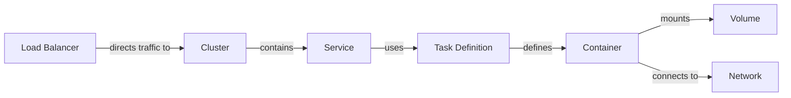

## Requirements

No requirements.

## Providers

| Name | Version |
|------|---------|
| <a name="provider_aws"></a> [aws](#provider\_aws) | n/a |

## Modules

No modules.

## Resources

| Name | Type |
|------|------|
| [aws_cloudwatch_log_group.this](https://registry.terraform.io/providers/hashicorp/aws/latest/docs/resources/cloudwatch_log_group) | resource |
| [aws_ecs_service.this](https://registry.terraform.io/providers/hashicorp/aws/latest/docs/resources/ecs_service) | resource |
| [aws_ecs_task_definition.this](https://registry.terraform.io/providers/hashicorp/aws/latest/docs/resources/ecs_task_definition) | resource |
| [aws_region.current](https://registry.terraform.io/providers/hashicorp/aws/latest/docs/data-sources/region) | data source |

## Inputs

| Name | Description | Type | Default | Required |
|------|-------------|------|---------|:--------:|
| <a name="input_assign_public_ip"></a> [assign\_public\_ip](#input\_assign\_public\_ip) | value for assign\_public\_ip | `bool` | `false` | no |
| <a name="input_cluster_name"></a> [cluster\_name](#input\_cluster\_name) | name of the cluster | `string` | n/a | yes |
| <a name="input_container_definitions"></a> [container\_definitions](#input\_container\_definitions) | values for container\_definitions | <pre>map(<br>    object({<br>      name      = string<br>      image     = string<br>      cpu       = optional(number, 256) # 0.5 vCPU<br>      memory    = optional(number, 512) # 512 MiB<br>      essential = optional(bool, true)<br>      expose    = optional(bool, false)<br>      port_mappings = optional(list(object({<br>        containerPort = number<br>        hostPort      = number<br>        protocol      = string<br>      })), [])<br><br>      environment_variables = optional(list(object({<br>        name  = string<br>        value = string<br>      })), [])<br><br>      secrets = optional(list(object({<br>        name      = string<br>        valueFrom = string<br>      })), [])<br><br>      health_check = object({<br>        command     = list(string)<br>        retries     = optional(number, 5)<br>        timeout     = optional(number, 10)<br>        interval    = optional(number, 5)<br>        startPeriod = optional(number, 30)<br>        }<br>      )<br>    })<br>  )</pre> | n/a | yes |
| <a name="input_desired_count"></a> [desired\_count](#input\_desired\_count) | value for desired\_count | `number` | n/a | yes |
| <a name="input_execution_role_arn"></a> [execution\_role\_arn](#input\_execution\_role\_arn) | value for execution\_role\_arn | `string` | `""` | no |
| <a name="input_load_balancer"></a> [load\_balancer](#input\_load\_balancer) | values for load\_balancer | <pre>object({<br>    target_group_arn = string<br>    container_name   = string<br>    container_port   = number<br>  })</pre> | `null` | no |
| <a name="input_log_retention"></a> [log\_retention](#input\_log\_retention) | Time retention in dyas to log groups | `number` | `7` | no |
| <a name="input_name"></a> [name](#input\_name) | value for name | `string` | n/a | yes |
| <a name="input_security_groups"></a> [security\_groups](#input\_security\_groups) | value for security\_groups | `list(string)` | n/a | yes |
| <a name="input_subnets"></a> [subnets](#input\_subnets) | value for subnets | `list(string)` | n/a | yes |
| <a name="input_tags"></a> [tags](#input\_tags) | value of the tags to apply to the ECS cluster | `map(string)` | <pre>{<br>  "AmazonECSManaged": "true",<br>  "created": "",<br>  "documentation": "",<br>  "env": "",<br>  "repository": "",<br>  "service": "",<br>  "team": ""<br>}</pre> | no |
| <a name="input_volume"></a> [volume](#input\_volume) | Volume configuration for the task | <pre>object({<br>    name           = string<br>    file_system_id = string<br>    root_directory = optional(string, "/")<br>  })</pre> | `null` | no |

## Outputs

No outputs.

# Módulo Terraform para AWS ECS

Esse modulo terraform é utilizado para criar Service, Task Definition e Target Group no loadbalance do cluster.



### Backend

Terraform utiliza o arquivo de backend para armazenar o estado atual da infraestrutura. 

```terraform
terraform {
  backend "s3" {
    bucket         = "drcash-terraform-tfstate"
    key            = "aws/<SERVICE-NAME>/terraform.tfstate"
    region         = "us-east-1"
    dynamodb_table = "terraform_state_lock"
  }
}
```

### Provider

Provider será declarado que tipo de Cloud ou Serviço SAAS a infraestrutura será provisionada. 

```terraform
provider "aws" {
  region = "us-east-1"
}
```

### Version

Version declaramos a versão dos providers. 

```terraform
terraform {
  required_providers {
    aws = {
      source  = "hashicorp/aws"
      version = "~> 5.0"
    }
  }
  required_version = "~> 1.7.4"
}
```

### Module

Modulo é a principal forma de empacotar e reutilizar configurações de recursos com o Terraform.

```terraform
module "ecs_service" {
  source = "git::ssh://git@github.com/drcash-brazil/drcash_platform_infrastructure.git//modules/aws/ecs-app?ref=<VERSION>"

  name             = "meu-servico"
  cluster_name     = "meu-cluster"
  desired_count    = 2
  assign_public_ip = false
  security_groups  = ["sg-0123456789abcdef0"]
  subnets          = ["subnet-0123456789abcdef0"]

  container_definitions = [
    {
      name         = "meu-container"
      image        = "minha-imagem:tag"
      cpu          = 256
      memory       = 512
      essential    = true
      port_mappings = [
        {
          containerPort = 8080
          hostPort      = 8080
          protocol      = "tcp"
        }
      ]
      environment_variables = [
        {
          name  = "VAR1"
          value = "valor1"
        },
        {
          name  = "VAR2"
          value = "valor2"
        }
      ]
      secrets = [
        {
          name  = "SRECT1"
          value = "valor1"
        }
      ]

      health_check = {
        command  = ["CMD-SHELL", "curl -f http://localhost:8080/ || exit 1"]
        interval = 30
        timeout  = 5
        retries  = 3
      }
    }
  ]

  volume = [
    {
      name            = "meu-volume"
      file_system_id  = "fs-0123456789abcdef0"
      root_directory  = "/"
    }
  ]

  tags = {
    env            = "dev"
    project        = "meu-projeto"
    service        = "service-name"
    team           = "devops"
    documentations = "link-documentation"
    repository     = "link-repository"
  }
}
```

### DiggerHQ

Digger é reponsável pelo CI/CD dos projetos terraform, para novos projetos declare o seguinte bloco no arquivo digger.yaml. 

```yaml
- name: NOME-SERVIÇO-<development, staging, production>
  dir: CAMINHO-DIRETORIO-SERVIÇO
  workflow: default
  workspace: <development, staging, production>
```
