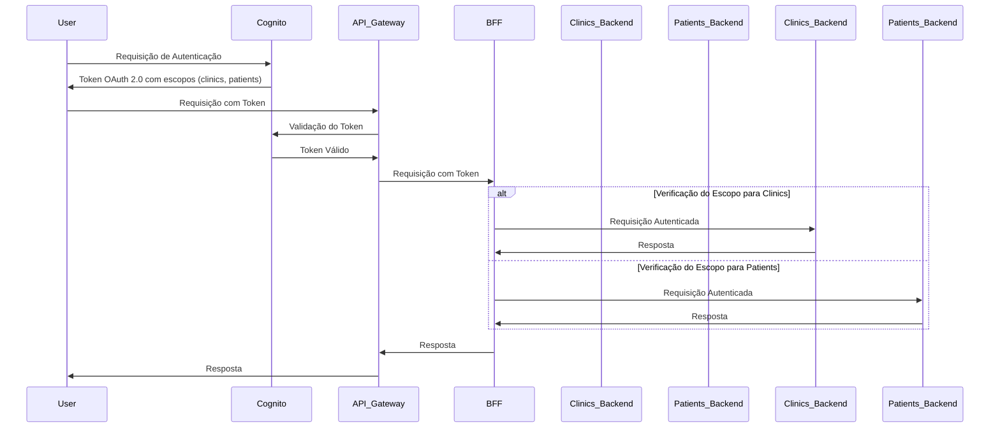

### Diagrama de Sequencia da Autenticação e Autorização

```mermaid
sequenceDiagram
    participant User
    participant Cognito
    participant APIGateway as API_Gateway
    participant BFF
    participant ClinicsBackend as Clinics_Backend
    participant PatientsBackend as Patients_Backend

    User ->> Cognito: Requisição de Autenticação
    Cognito ->> User: Token OAuth 2.0 com escopos (clinics, patients)
    User ->> APIGateway: Requisição com Token
    APIGateway ->> Cognito: Validação do Token
    Cognito ->> APIGateway: Token Válido
    APIGateway ->> BFF: Requisição com Token

    alt Verificação do Escopo para Clinics
        BFF ->> Clinics_Backend: Requisição Autenticada
        Clinics_Backend ->> BFF: Resposta
    else Verificação do Escopo para Patients
        BFF ->> Patients_Backend: Requisição Autenticada
        Patients_Backend ->> BFF: Resposta
    end

    BFF ->> APIGateway: Resposta
    APIGateway ->> User: Resposta
```